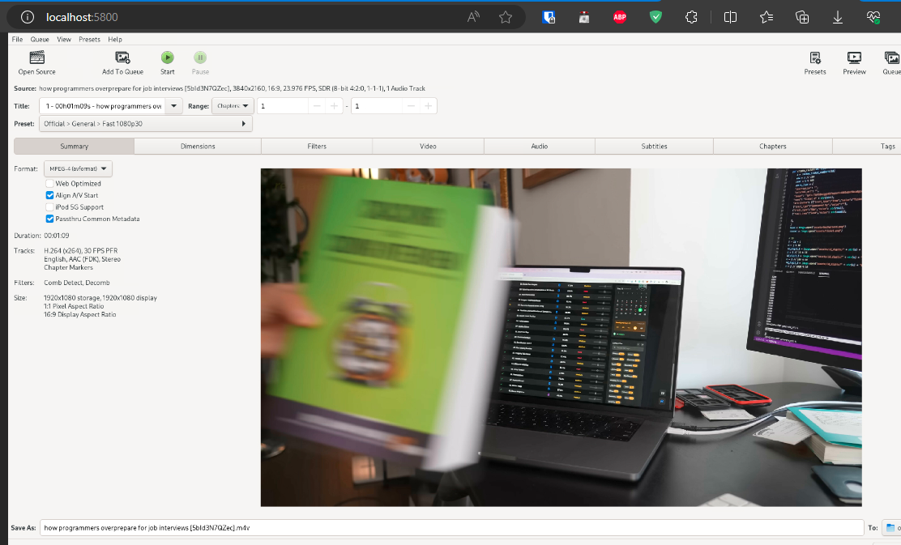

# Atelier Docker - HandBrake

## Quelle commande utiliseriez-vous pour télécharger l'image Docker de HandBrake?
docker pull jlesage/handbrake

## Comment lanceriez-vous un conteneur HandBrake pour traiter une vidéo située sur votre machine hôte?
docker run -d --name=handbrake -p 5800:5800 -v D:/M1/devops-mewo:/storage:rw -v 
D:/M1/devops-mewo/output:/output:rw jlesage/handbrake
url: http://localhost:5800/

## Quelles commandes permettent d'inspecter les détails et les logs d'un conteneur actif?
docker inspect handbrake
docker logs handbrake

## Comment arrêter, redémarrer, et finalement supprimer un conteneur et une image?
docker stop handbrake
docker restart handbrake
docker rm handbrake

docker rmi jlesage/handbrake

